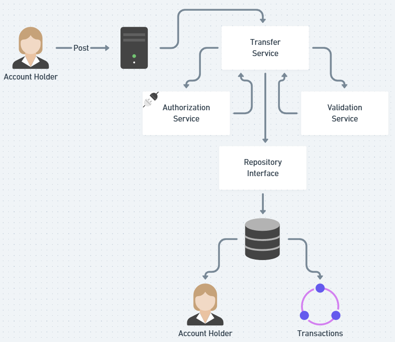

# simple-payments
## Requisites

### Business rules:

- For both Account Holder Type, these attributes should be used: `Full Name`, `CPF`(unique), `e-mail`(unique) and `password`
- Account Holders can transfer money to each other, however `MERCHANT` cannot send money.
- Account Holders cannot send money if they do not have enough balance
- All transactions should be authorized through the service: [https://util.devi.tools/api/v2/authorize](https://util.devi.tools/api/v2/authorize)
- The transaction should be reverted in case of error 
- This should be a RESTFull service

## Transfer Endpoint

```http request
POST /transfer
Content-Type: application/json

{
  "value": 100.0,
  "payer": 4,
  "payee": 15
}
```

## Technologies
* [Spring Boot](https://spring.io/projects/spring-boot)
* [Spring MVC](https://docs.spring.io/spring-framework/reference/web/webmvc.html)
* [Maven](https://maven.apache.org/)
* [Mapstruct](https://mapstruct.org/)
* [Docker compose](https://docs.docker.com/compose/)
* [Springdoc](https://springdoc.org/)
* [Spring Actuator](https://docs.spring.io/spring-boot/docs/2.0.x/actuator-api/html/) as part of Observability
* [Liquibase](https://www.liquibase.com/) as database versioning
* [PostgreSQL](https://www.postgresql.org/) as a database
* [Testcontainers](https://testcontainers.com/)

## Architecture
Based on [Clean Architecture](https://blog.cleancoder.com/uncle-bob/2012/08/13/the-clean-architecture.html)
```
src/main/java
└── com/simple/payments
    |── adapters/ 
    │   ├── inbound
    │   └── outbound
    ├── application
    │   ├── service
    │   └── PaymentsApplication.java
    ├── config/
    └── domain/

```
## Design


## Running the application using docker compose
### Clone this repository:
```
git clone git@github.com:cristianoAlves/simple-payments.git
```

#### From app root directory:
```
docker compose up -d --build
```
### Test API
`curl http://localhost:8081/accounts`
### Test using actuator
`curl http://localhost:8081/actuator`

### API documentation
http://localhost:8081/swagger-ui/index.html
